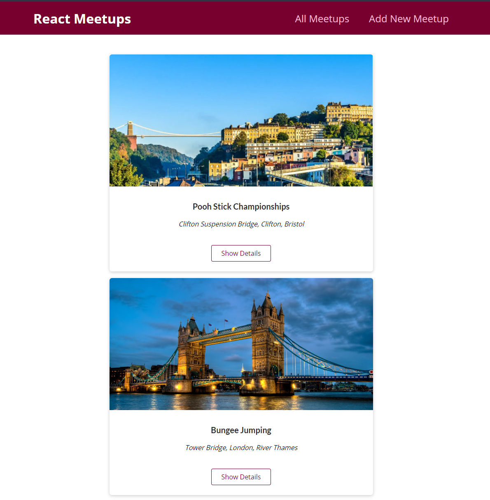

# Meetup-NextJS
Simple application to post meetup events - supported by NextJS

# **Meetup Application using NextJS**

Library to upload and share community meetups - using NextJS for full stack React capabilities and integrated to MongoDB via custom API POST/GET functionality..

Deployed using Vercel for the following link; [Meetup-NextJS](https://meetup-next-js.vercel.app/).

